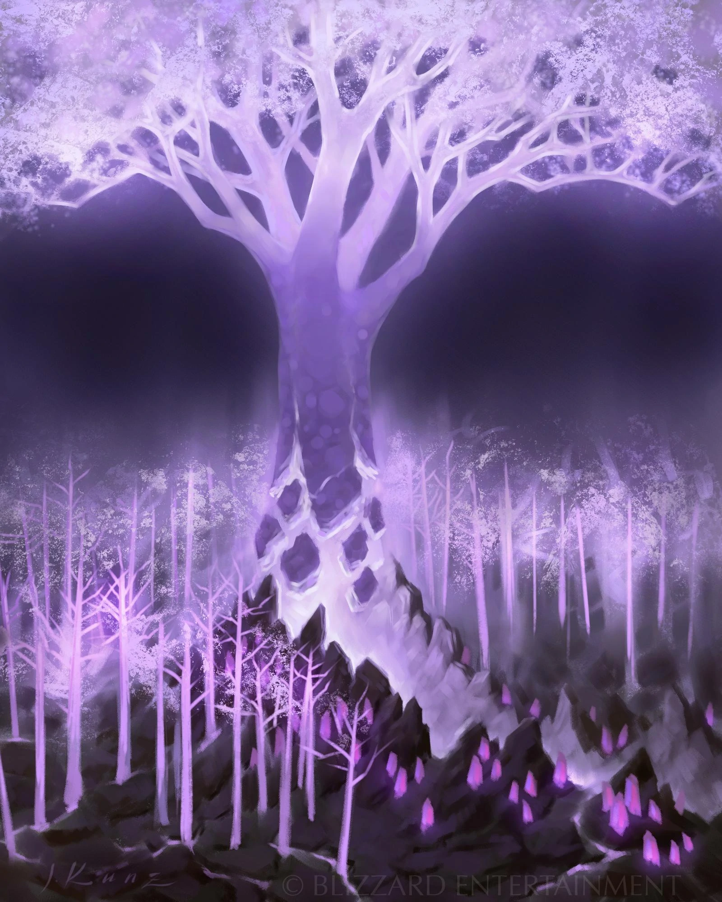
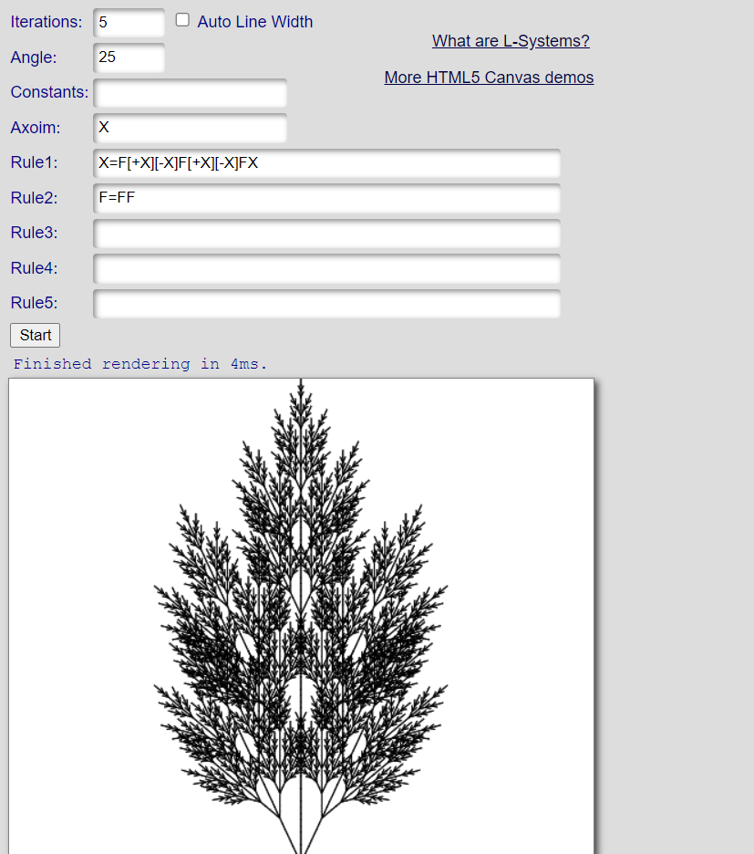
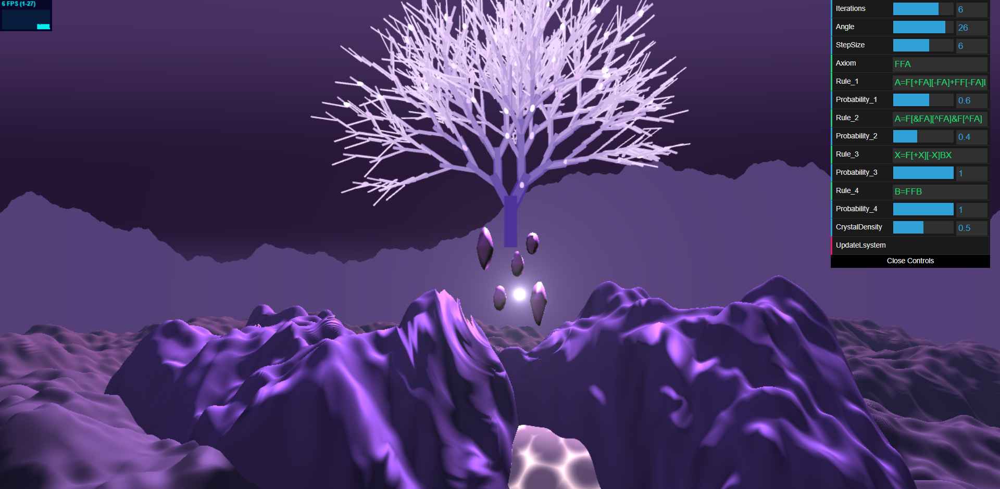
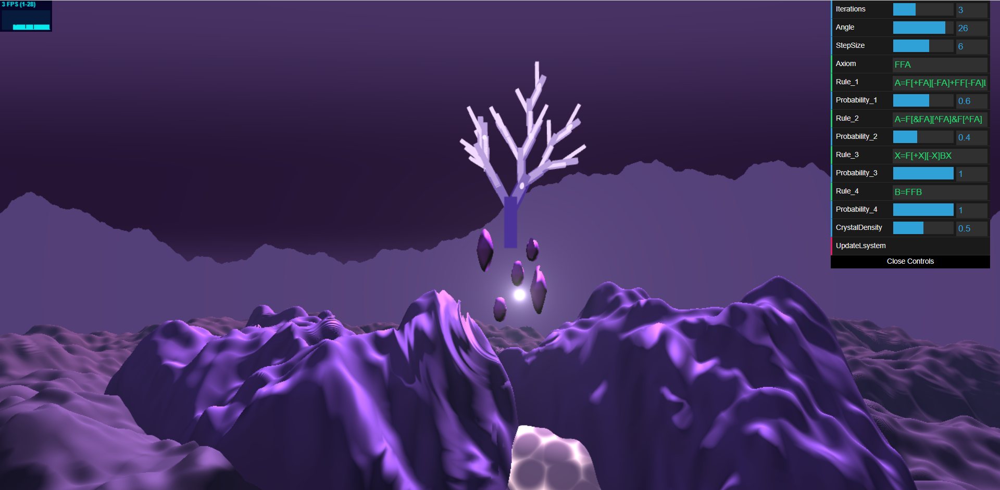
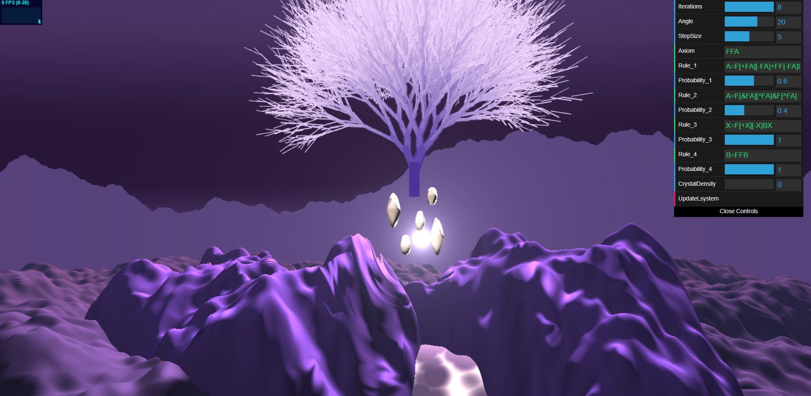

# Project 3: L-Systems

Name: Megan Reddy \
PennKey: meganr28

# Crystalsong Forest Tree

<p align="center">
   
</p>

For this assignment, I loosely based my L-system tree on the trees from World of Warcraft's Crystalsong Forest. I really liked the purple color palette and magical feel of the screenshots/artwork below. There are many interesting features to take note of, such as the rocky terrain, crystals suspended in mid-air, bloom effect on the trees, and color gradient moving up the tree trunk. I tried to capture some of these in my scene using previous concepts we have learned - color palettes, SDFs, and noise. In addition to the visual aspects of the scene, a large portion of this project was spent building the L-system parsing and rendering engine. Implementing the L-system from scratch was a really good learning experience, especially for understanding which rules lead to specific visual results.

| Reference 1        |  Reference 2  |
:-------------------------:|:-------------------------:|
  |   |


## [Live Demo Link](https://meganr28.github.io/hw03-l-systems/)

## GUI Controls

The artist can control these parameters:
* `Iterations` - number of generations (higher = bigger tree)
* `Angle` - angle of rotation
* `Step Size` - step length
* `Axiom` - initial state/configuration 
* `Crystal Density` - quantity of crystals in the tree
* `Rules` - determine what symbols appear (each maps to a drawing command)
* `Probability` - probability that the rule will be chosen (to add randomness)

## L-System Classes

First, I began by planning out which classes I needed to implement an L-System engine. Below, I have highlighted the most important functions in each file. See each file in the `lsystem/src` directory for the complete implementation.

`LinkedList.ts`

```
// This represents a symbol in the grammar (e.g. "A" or "B")
export class SymbolNode;

// This represents a sequence of SymbolNodes (e.g. "ABBAA")
class LinkedList {
    convertToLinkedList(axiom: string, iteration : number);            // converts input string from GUI to LinkedList
    expandNode(new_sym : string, index : number, iteration : number);  // expands a SymbolNode by replacing it with several new nodes
};
```

`LSystemParser.ts`

```
// Represents the postcondition for an expansion rule (e.g. AB in A -> AB)
export class ExpansionPostcondition {
	sym: string;
	probability: number;
};

// Represents an expansion rule (may map to multiple postconditions, hence the array)
export class ExpansionRule {
	postconditions: Array<ExpansionPostcondition> = new Array();
};

// Stores all expansion rules as key, value pairs
export class ExpansionRuleMap {
	expansionRules: Map<string, ExpansionRule> = new Map();
};

// Expands a given axiom into a string
class LsystemParser {
    applyRule(precondition : string); // Queries the Expansion Map for a postcondition
    parse();                          // Expands axiom
};
```

`LSystemRenderer.ts`

```
// Represents the postcondition for a drawing rule (e.g. "move forward")
export class DrawingPostcondition {
    drawCmd: any;
	probability: number;
};

// Represents a drawing rule (e.g. F -> "move forward")
export class DrawingRule {
	postconditions: Array<DrawingPostcondition> = [];
};

// Stores all drawing rules as key, value pairs
export class DrawingRuleMap {
	drawingRules: Map<string, DrawingRule> = new Map();
};

// Reads in a sequence of SymbolNodes and maps them to a drawing command
class LsystemRenderer {
    render();
};

```

`Turtle.ts`

```
class Turtle {
  position: vec3 = vec3.create();     // Position of turtle
  direction: vec3 = vec3.create();    // Orientation expressed as ray direction (not normalized)
  orientation: vec3 = vec3.create();  // Orientation expressed as Euler Angles (X, Y, Z)
  depth: number = 0;                  // Recursion depth

  // Moving commands
  moveForward();
  rotateLeft();
  rotateRight();
  pitchUp()
  pitchDown();
  rollCounterClockwise();
  rollClockwise();
};
```


## L-System Rendering

Once the classes were in place, it was time to put them to the test. I first tested my implementation on familiar 2D grammars such as the Koch curve and Sierpinski triangle to make sure there were no bugs. After fully testing basic grammar expansion and rendering, I tried extending these to 3D. I started with the basic grammar `F[+F][-F]` and built upon this continuously for my tree, adding small modifications to see the visual result. The result I was looking for was a tree with a wide base and leaves that extended far horizontally. It was tricky to get this effect and small branch details at the same time. One look I came up with in a [2D test engine](https://kevs3d.co.uk/dev/lsystems/) was this:

<p align="center">
   
</p>

Although I liked the small leaf details, the tree was too narrow for what I was looking for. I finally settled on this grammar:

```
Axiom: "FFA",
Rule_1: "A=F[+FA][-FA]+FF[-FA]L",
Probability_1: 0.6,
Rule_2: "A=F[&FA][^FA]&F[^FA]",
Probability_2: 0.4,
```

This grammar features one precondition with two postconditions, which are picked based on a probability. For the tree geometry, I used cubes for the branches and spheres for the "crystal" leaves. Unfortunately, I could not get mesh loading to work, but I am hoping to revisit this and add more visually interesting geometry later! I added a color gradient from the bottom to the top of the tree to mimic the reference images. The color of each branch is decided based on the iteration in which it was added - darker for earlier generations and lighter for later generations. 

In addition to specifying probabilities for rules, I also added a value to specify how many crystals the user wants on the tree. I generate a random number with `Math.random()` and compare this to the GUI value to decide whether or not to draw a leaf in the specified position. I also perturb the orientation of the crystals slightly based on a random number so they are not pointing in the same direction. 

Here are more screenshots with different iterations, angles, step sizes, and crystal densities:

| Iter: 6, Angle: 26, Step: 6, Density: 0.5        |  Iter: 3, Angle: 26, Step: 6, Density: 0.5  |
:-------------------------:|:-------------------------:|
  |   |  

| Iter: 8, Angle: 14, Step: 6, Density: 1           |  Iter: 8, Angle: 20, Step: 5, Density: 0  | 
:-------------------------:|:-------------------------:|
  |   |  

### References

* Paul Bourke, [L-System User Notes](http://paulbourke.net/fractals/lsys/)
* Houdini, [L-System geometry node](https://www.sidefx.com/docs/houdini/nodes/sop/lsystem.html)
* Wikipedia, [L-system](https://en.wikipedia.org/wiki/L-system)
* Inigo Quilez, [Distance Functions](https://iquilezles.org/articles/distfunctions/)
* UPenn CIS 566 Course Notes - L-Systems
* UPenn CIS 560 Course Notes - Noise Functions
